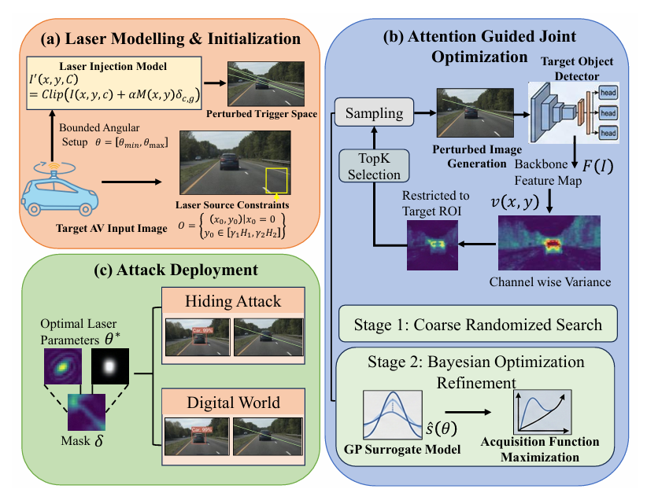
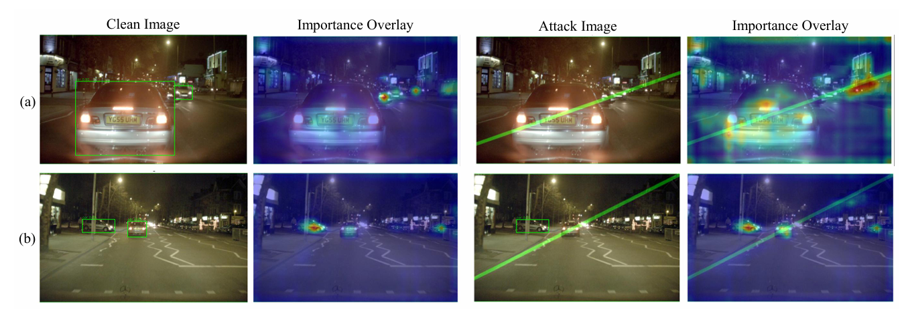
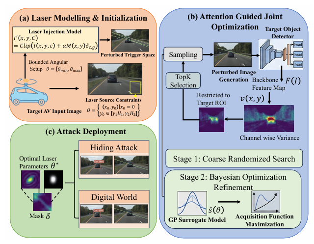
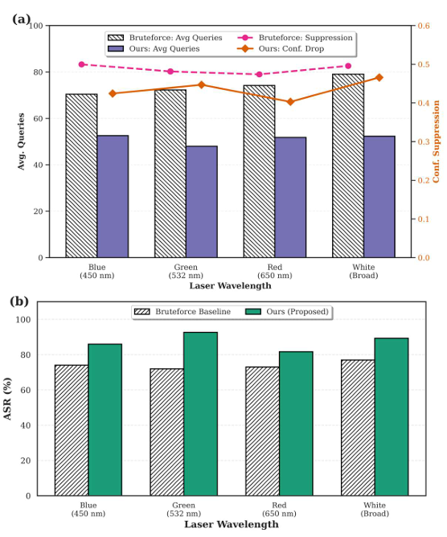

<div align="center">

# 🎯 HideMe: Physically Constrained Attention Guided Laser Attacks on Autonomous Vehicle Perception

[](https://arxiv.org/abs/your-paper-id)
[](LICENSE)
[](https://www.python.org/)
[](https://pytorch.org/)
[](https://github.com/psf/black)

**A novel attention-guided laser attack framework for compromising autonomous vehicle perception systems**

[📄 Paper](https://arxiv.org/abs/your-paper-id) | [📊 Results](#results) | [🚀 Quick Start](#installation)

---



*HideMe achieves **92.7% attack success rate** with only **52 queries**, demonstrating **15.6× higher efficiency** compared to existing laser-based attacks.*

</div>

---

## 🌟 Highlights

- **🎯 High Attack Success Rate**: Achieves 92.7% ASR on YOLOv8m with minimal queries
- **⚡ Query Efficient**: Requires only 52 queries compared to 834 in prior work (16× reduction)
- **🧠 Attention-Guided**: Leverages channel-wise variance to identify detector-sensitive regions
- **🏗️ Two-Stage Optimization**: Combines coarse randomized search with Bayesian refinement
- **🔬 Cross-Architecture Validation**: Tested on YOLOv8, Faster R-CNN, RetinaNet
- **🌙 Nighttime Focused**: Optimized for low-light conditions using NightOwls dataset
- **🎨 Physically Realizable**: Constrained laser parameters for real-world deployment

---

## 📋 Table of Contents

- [Overview](#overview)
- [Key Features](#key-features)
- [Attack Methodology](#attack-methodology)
- [Results](#results)
- [Installation](#installation)
- [Usage](#usage)
- [Dataset](#dataset)
- [Citation](#citation)
- [Acknowledgments](#acknowledgments)
- [License](#license)

---

## 🔍 Overview

**HideMe** is a physically constrained roadside laser attack that effectively hides vehicles from autonomous vehicle (AV) perception modules. Unlike existing approaches that use inefficient search strategies or are unaware of detector-sensitive areas, HideMe employs an attention-guided optimization approach that:

1. **Exploits channel-wise variance** of the detector's feature map to identify sensitive regions
2. **Optimizes laser parameters** through a two-stage search process
3. **Maintains physical constraints** for real-world feasibility

<div align="center">


*Figure 1: HideMe attack demonstration showing clean detection (left) vs. successful hiding attack (right)*
</div>

### 🎯 Attack Goals

The adversary aims to trigger **object-level detection failures** by making legitimate front-facing vehicles invisible to the detector, potentially causing dangerous driving behaviors in the decision-making module.

---

## 💡 Key Features

### 1. **Attention-Guided Targeting** 🎯
```python
# Channel-wise variance computation for detector sensitivity
V(x, y) = (1 / (C-1)) * Σ[Fc(x,y) - (1/C) * Σ Fj(x,y)]²
```
- Identifies high inter-channel activation contrasts
- Provides gradient-free, black-box detector sensitivity
- Computationally efficient surrogate for sensitive regions

### 2. **Two-Stage Optimization** ⚙️

| Stage | Method | Purpose | Queries |
|-------|--------|---------|---------|
| **Stage 1** | Coarse Randomized Search | Quick confidence suppression | ~30-40 |
| **Stage 2** | Bayesian Optimization | Parameter refinement | ~10-20 |

### 3. **Physical Constraints** 🔬
- **Laser Origin**: Constrained to lower-left roadside area
- **Projection Angle**: θ ∈ [-60°, -10°]
- **Beam Width**: w ≤ 20 pixels
- **Wavelengths Tested**: 450nm (Blue), 532nm (Green), 650nm (Red), White

---

## 🛠️ Attack Methodology

<div align="center">

</div>

### Step-by-Step Process

#### **Phase 1: Laser Modeling & Initialization**
```python
# Laser injection model
I'(x, y, c) = clip(I(x, y, c) + α·M(x, y)·δc,g)
```
- Model laser as linear perturbation on image plane
- Apply physical constraints (position, angle, width)
- Simulate optical bloom with Gaussian smoothing

#### **Phase 2: Attention-Guided Optimization**
1. Extract backbone feature map F(I)
2. Compute channel-wise variance V(x, y)
3. Select TopK sensitive points within vehicle ROI
4. Stage 1: Randomized sampling over S × Θ
5. Stage 2: Bayesian refinement using GP surrogate

#### **Phase 3: Attack Deployment**
- Apply optimized laser parameters
- Validate hiding effectiveness
- Deploy in digital/physical domains

---

## 📊 Results

### Performance Across Detectors

| Architecture | Detector | ASR ↑ | Queries ↓ | Conf. Drop ↓ |
|-------------|----------|-------|-----------|--------------|
| **One-stage** | YOLOv8n | **94.7%** | 7.36 | 0.5078 |
| | YOLOv8s | 92.0% | 22.17 | 0.3729 |
| | YOLOv8m | **92.7%** | 52 | 0.3892 |
| | RetinaNet | 89.3% | 26.36 | 0.4176 |
| **Two-stage** | Faster R-CNN | 86.7% | 59.99 | 0.3236 |

### Comparison with Baselines

<div align="center">

| Method | ASR ↑ | Queries ↓ | ASR/Q ↑ | Efficiency Gain |
|--------|-------|-----------|---------|-----------------|
| Random Laser | 43.0% | 122.82 | 0.00350 | 1.0× |
| Grid Search | 62.0% | 89.62 | 0.00692 | 2.0× |
| Gradient-Free | 31.0% | 54.00 | 0.00574 | 1.6× |
| AdvLB [6] | 95.1% | **834** | 0.00114 | 0.3× |
| AdvI [7] | 84.4% | 189.7 | 0.00445 | 1.3× |
| **HideMe (Ours)** | **92.7%** | **52** | **0.01783** | **5.1×** |

</div>

### Laser Wavelength Analysis

<div align="center">


*Green laser (532nm) achieves the best performance with 92.7% ASR*
</div>

### Distance Robustness

| Scenario | Initial Conf. | Final Conf. | Reduction | Queries | Time |
|----------|---------------|-------------|-----------|---------|------|
| **Near Vehicle** | 0.9198 | 0.0000 | 100% | 22 | 1.72s |
| | 0.5744 | 0.0000 | 100% | 22 | 1.72s |
| **Far Vehicle** | 0.8387 | 0.3182 | 62.1% | 45 | - |

---

## 🚀 Installation

### Prerequisites
- Python 3.8+
- PyTorch 2.0+
- CUDA 11.0+ (for GPU acceleration)

### Setup

```bash
# Clone the repository
git clone https://github.com/gsai21/HideMe.git
cd HideMe

# Create virtual environment
python -m venv hideme_env
source hideme_env/bin/activate  # On Windows: hideme_env\Scripts\activate

# Install dependencies
pip install -r requirements.txt

# Install YOLOv8
pip install ultralytics

# Download pretrained models
python scripts/download_models.py
```

### Requirements

```txt
torch>=2.0.0
torchvision>=0.15.0
ultralytics>=8.0.0
opencv-python>=4.7.0
numpy>=1.24.0
scikit-learn>=1.2.0
scipy>=1.10.0
matplotlib>=3.7.0
tqdm>=4.65.0
pyyaml>=6.0
```

---

## 💻 Usage

### Quick Start

```python
from hideme import HideMeAttack
from ultralytics import YOLO

# Load detector
detector = YOLO('yolov8m.pt')

# Initialize HideMe attack
attack = HideMeAttack(
    detector=detector,
    wavelength='green',  # Options: 'blue', 'green', 'red', 'white'
    max_queries=100,
    confidence_threshold=0.1
)

# Load target image
image_path = 'data/nightowls/sample_001.jpg'

# Execute attack
attacked_image, results = attack.run(image_path)

# Visualize results
attack.visualize(attacked_image, results, save_path='output/attack_result.jpg')
```

### Advanced Configuration

```python
# Custom attack parameters
attack_config = {
    'laser_params': {
        'width_range': [5, 20],      # pixels
        'intensity_range': [0, 1.0],  # normalized
        'angle_range': [-60, -10],    # degrees
        'origin_y_range': [0.65, 0.9] # normalized height
    },
    'optimization': {
        'stage1_samples': 30,
        'stage2_iterations': 20,
        'topk_targets': 10,
        'early_stop': True
    },
    'physical_constraints': {
        'apply_bloom': True,
        'bloom_sigma': 2.0,
        'color_channel': 'green'  # g, r, b, or white
    }
}

attack = HideMeAttack(detector, **attack_config)
```

### Batch Processing

```bash
# Run attack on entire dataset
python run_attack.py \
    --dataset nightowls \
    --detector yolov8m \
    --wavelength green \
    --output_dir results/batch_attack \
    --num_workers 4
```

### Evaluation

```bash
# Evaluate attack performance
python evaluate.py \
    --results_dir results/batch_attack \
    --metrics ASR recall confidence_drop \
    --save_plots True
```

---

## 📂 Project Structure

```
HideMe/
├── 📄 README.md
├── 📄 LICENSE
├── 📄 requirements.txt
├── 📂 hideme/
│   ├── __init__.py
│   ├── attack.py              # Main attack implementation
│   ├── laser_model.py         # Laser injection model
│   ├── attention.py           # Attention-guided targeting
│   ├── optimization.py        # Bayesian optimization
│   └── utils.py               # Utility functions
├── 📂 models/
│   ├── yolov8n.pt
│   ├── yolov8s.pt
│   ├── yolov8m.pt
│   └── faster_rcnn.pth
├── 📂 data/
│   └── nightowls/             # NightOwls dataset
├── 📂 scripts/
│   ├── download_models.py
│   ├── download_dataset.py
│   └── visualize.py
├── 📂 configs/
│   ├── default.yaml
│   └── wavelengths.yaml
├── 📂 results/                # Attack results and logs
├── 📂 assets/                 # Images for README
└── 📂 tests/                  # Unit tests
```

---

## 📊 Dataset

### NightOwls Dataset

We use the **NightOwls** dataset specifically designed for nighttime pedestrian and vehicle detection:

- **Size**: 1,500 annotated nighttime images
- **Source**: [NightOwls Official](https://www.nightowls-dataset.org/)
- **Reason**: Laser beams are most effective in low-light conditions

```bash
# Download NightOwls dataset
python scripts/download_dataset.py --dataset nightowls --split test
```

### Custom Dataset

To use your own nighttime images:

```python
from hideme.data import prepare_custom_dataset

# Prepare your images
prepare_custom_dataset(
    image_dir='path/to/your/images',
    output_dir='data/custom',
    annotation_format='yolo'  # or 'coco'
)
```

---

## 🔬 Reproducing Results

### Run Full Evaluation Suite

```bash
# Reproduce Table I results (Cross-architecture performance)
bash scripts/reproduce_table1.sh

# Reproduce Table II results (Comparison with baselines)
bash scripts/reproduce_table2.sh

# Reproduce Figure 2 (Distance robustness)
python scripts/reproduce_fig2.py

# Reproduce Figure 3 (Wavelength analysis)
python scripts/reproduce_fig3.py
```

### Expected Runtime
- **Single Image Attack**: ~2-5 seconds (NVIDIA RTX 3090)
- **Full Dataset (1,500 images)**: ~1-2 hours
- **All Experiments (Tables + Figures)**: ~4-6 hours

---

## 🎓 Citation

If you find this work useful for your research, please cite:

```bibtex
@inproceedings{gonthina2024hideme,
  title={HideMe: Physically Constrained Attention Guided Laser Attacks on Autonomous Vehicle Perception},
  author={Gonthina, Sai Sriram and Roy, Sandip and U, Venkanna and Shetty, Sachin},
  booktitle={Proceedings of the IEEE/CVF Conference on Computer Vision and Pattern Recognition},
  year={2024}
}
```

---

## 👥 Authors

<div align="center">

| Author | Affiliation | Contact |
|--------|-------------|---------|
| **Sai Sriram Gonthina** | IIIT Naya Raipur | gonthina22100@iiitnr.edu.in |
| **Sandip Roy** | Old Dominion University | sroy@odu.edu |
| **Venkanna U** | NIT Warangal | venkannau@nitw.ac.in |
| **Sachin Shetty** | Old Dominion University | sshetty@odu.edu |

</div>

---

## 🙏 Acknowledgments

- **NightOwls Dataset** team for providing high-quality nighttime driving data
- **Ultralytics** for the YOLOv8 implementation
- **PyTorch** team for the deep learning framework
- All reviewers and contributors who helped improve this work

---

## ⚖️ License

This project is licensed under the MIT License - see the [LICENSE](LICENSE) file for details.

---

## ⚠️ Disclaimer

**This research is intended for academic and defensive security purposes only.** The techniques presented should be used responsibly to:

- Understand vulnerabilities in AV perception systems
- Develop robust defenses against adversarial attacks
- Improve the safety and reliability of autonomous vehicles

**Malicious use of these techniques may be illegal and unethical.** Users are responsible for ensuring compliance with applicable laws and ethical guidelines.

---

## 🛡️ Defense Recommendations

For AV manufacturers and researchers developing defenses:

1. **Multi-Sensor Fusion**: Combine camera with LiDAR and radar
2. **Anomaly Detection**: Monitor for unusual light patterns
3. **Temporal Consistency**: Track objects across multiple frames
4. **Adversarial Training**: Include laser-perturbed samples in training
5. **Optical Filtering**: Use wavelength-specific filters on cameras

---

## 📮 Contact

For questions, suggestions, or collaborations:

- **GitHub Issues**: [Open an issue](https://github.com/gsai21/HideMe/issues)
- **Email**: gonthina22100@iiitnr.edu.in
- **Website**: [Project Page](https://your-project-page.com)

---

<div align="center">

### ⭐ Star this repository if you find it helpful!

[](https://github.com/gsai21/HideMe)
[](https://github.com/gsai21/HideMe/fork)

**Made with ❤️ for advancing AV security research**

</div>
